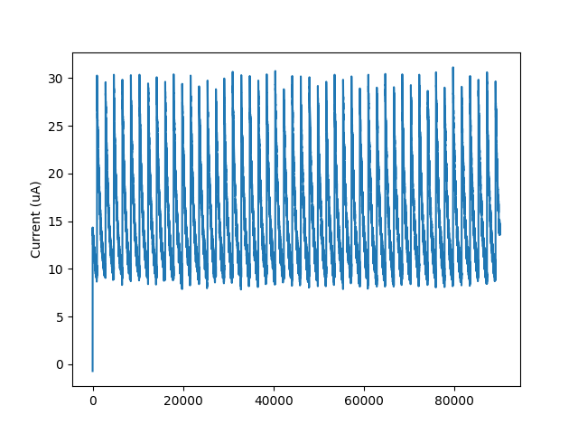
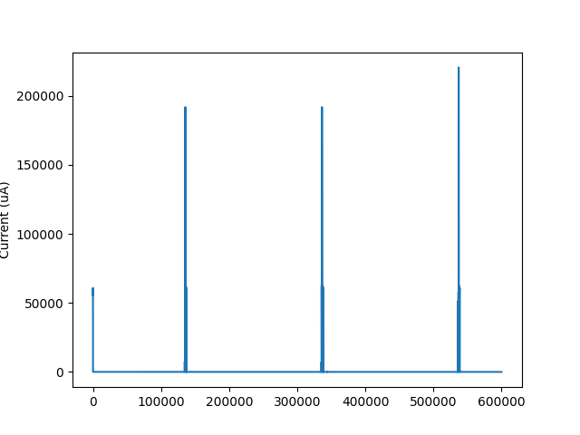

# WiFi Power Measurement Tests

This folder contains tests for measuring power consumption of a device using WiFi and shell commands.

## Description

The `test_power_meas_wifi_shell.py` script contains tests for measuring power consumption of a device using WiFi  shell commands.


## Prerequisites

Before running the tests in this script, ensure that the following prerequisites are met:

- The PPK2 is connected to the 7002 DK.
- The nRF7002 DK is pre-provisioned with the WIFI SSID and password. You can do that by flashing the shell sample and then using `wifi_cred add` command.
- Working python installation and all required python modules listed in `requirements.txt`.
- WOrking NCS toolchain required to build wifi shell.

## Hardware setup


## Usage

```
pytest .
```
## Expectaions

### Radio OFF State:
- Expected average current: 15 µA
- Threshold: 10%

### Scan State
- Expected average current: 58,442 µA
- Threshold: N/A

### Connected State
- Expected average current: 10,000 µA
- Threshold: 60%

### TWT Stage 
TWT_WAKE_DURATION_US: 8192 microseconds
TWT_WAKE_INTERVAL_US: 2 seconds

- Expected average current: 450 µA
- Threshold: 25%

### Post TWT stage (Connected):

- Expected average current: 7,000 µA
- Threshold: 60%

## Results

The following images show the sample power consumption figures obtained by the test cases.







